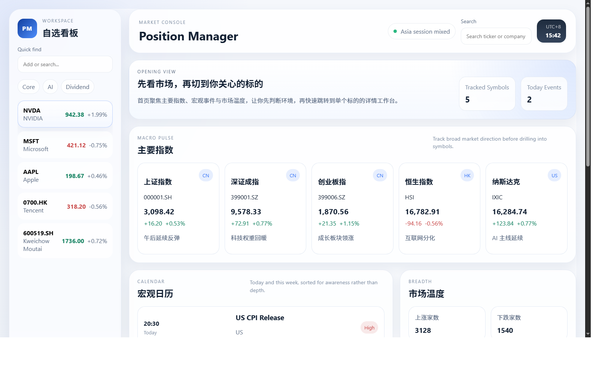
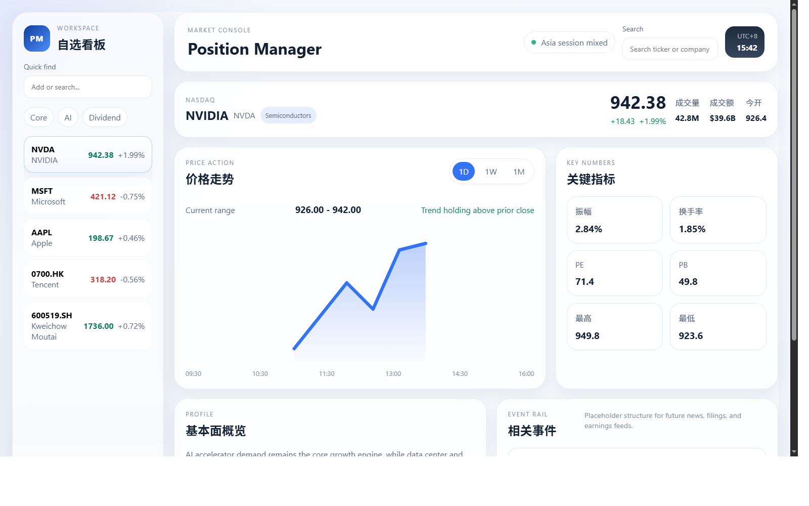

# Invest Assist

一个面向桌面 Web 的看盘原型，用来先确定首版的信息架构、视觉风格和页面布局。

当前版本不接真实行情，重点是把以下核心流转先跑通：

- 首页先看大盘总览
- 左侧常驻自选列表
- 点击标的进入详情工作台
- 在详情页查看行情摘要、价格走势、关键指标和基本面占位

## 预览

### 大盘总览



### 标的详情



## 技术栈

- React 18
- TypeScript
- Vite
- React Router
- Vitest + Testing Library

## 本地运行

```bash
npm install
npm run dev
```

开发地址固定为：

```text
http://localhost:3000/
```

如果 `3000` 端口被占用，Vite 会直接报错，不会自动切换到其他端口。

## 页面结构

### 首页 `/`

- 主要指数卡组
- 宏观日历
- 市场温度
- 关注标的快捷入口

### 标的详情 `/symbol/:ticker`

- 行情头部摘要
- 价格走势切换区（`1D / 1W / 1M`）
- 关键指标
- 基本面概览
- 相关事件占位

## 交互范围

- 左侧自选列表可常驻切换标的
- 首页快捷标的可直接跳转详情
- 搜索框目前只保留 UI
- 图表使用 mock 数据与简化可视化表达

## 校验

```bash
npm test
npm run build
```
